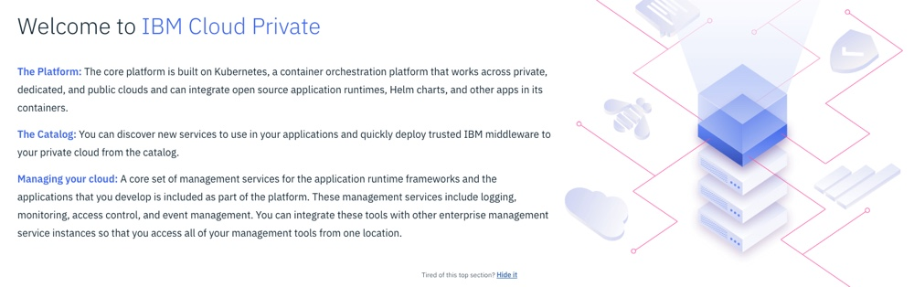
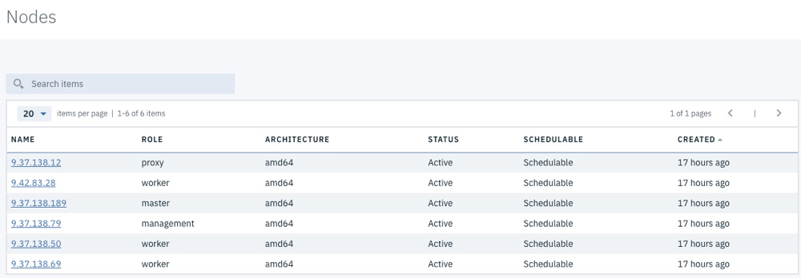
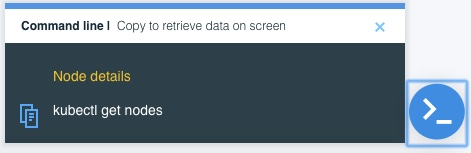

Lab - Console Treasure Hunt
---

### Table of contents
[1. Log in to your ICP Admin Console ](#login)

[2. Getting Started](#gettingstarted)

[3. Dashboard](#dashboard)

[4. Nodes](#nodes)

[4. Namespaces](#namespaces)

[5. Helm Charts](#helmcharts)

[7. Monitoring](#monitoring)

[8. Alerts](#alerts)

[9. Deployments](#deployments)

[10. StatefulSets](#statefulsets)

[11. DaemonSets](#daemonsets)

[12. Services](#services)

[13. Ingress](#ingress)

[14. Command Line Parameters](#cmdline)

## Overview
In this lab exercise you will become familiar with the IBM Cloud Private Administration Console by completing a Treasure Hunt.

### Log in to your ICP Admin Console 
If you aren't already logged in to the ICP Admin Console from a previous exercise, open a browser and navigate to `https://<icp_master_ip>/8443`

Log in using `username: admin` and `password: admin`

### Getting Started 
The first screen that is displayed when you successfully log in is the **Getting Started** page.

Locate the following information:

1. Which catalog item would you use if you want to **migrate an application that uses WebSphere Application Server**?

2. Which catalog item would you use if you want to **build a 12-factor microservice**?

3. What tool could you use to **chat with the team** if you have any issues?

### Dashboard 
Click **Menu** (in the top left corner of the page) and then select **Dashboard** to navigate to the Dashboard page. The Dashboard page provides an overview of the current status of the ICP cluster.

Locate the following information:

1. How many **Nodes** are in your ICP Cluster?

2. How much **Storage** is currently available in your ICP Cluster?

3. Are all of the **Deployments** in your ICP Cluster healthy?

### Nodes 
Click **Menu** and then select **Platform > Nodes** to navigate to the Nodes page. This page displays information about the nodes that are part of the ICP Cluster.

Note: Click the **command prompt** icon in the bottom right corner of the screen to see the command that a user would need to issue from the **Kubernetes CLI command prompt** to see the same information that has been displayed in the Administration Console.

Click on the **Name** of the node to *drill down* and see more information about a node.

Locate the following information:

1. How many **Worker nodes** are in your cluster?

2. What is the **Architecture** of your master node?

3. How much **memory** does your proxy node have?

4. How many **CPUs** do each of your worker nodes have?

5. Which node is the **logging-elk-data-0** pod deployed to?

### Namespaces 
Click **Menu** and then select **Manage > Namespaces** to navigate to the Namespaces page

### Helm Charts 
Click **Catalog** on the navigation bar to navigate to the Helm Chart Catalog page

### Storage 
Click **Menu** and then select **Platform > Storage** to navigate to the Storage page

### Monitoring 
Click **Menu** and then select **Platform > Monitoring** to navigate to the Monitoring page

### Alerts 
Click **Menu** and then select **Platform > Alert** to navigate to the Alerts page

### Deployments 
Click **Menu** and then select **Workloads > Deployments** to navigate to the Deployments page

### StatefulSets 
Click **Menu** and then select **Workloads > StatefulSets** to navigate to the StatefulSets page

### DaemonSets 
Click **Menu** and then select **Workloads > DaemonSets** to navigate to the DaemonSets page

### Services 
Click **Menu** and then select **Network Access > Services** to navigate to the Services page

### Ingress 
Click **Ingress** to navigate to the Ingress page

#### Command Line Parameters 
Click the **User** icon on the navigation bar and then select **Configure Client** to display the commands that are used to configure a kubectl command line to connect to this ICP Cluster
