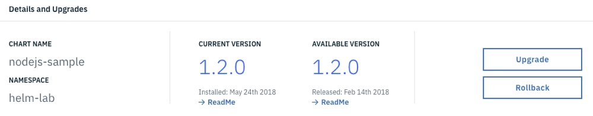
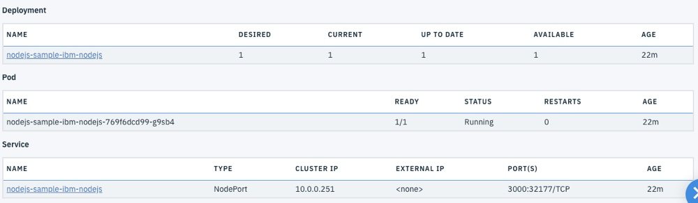
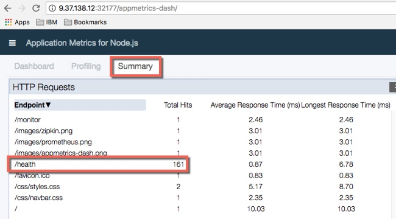

Lab - Deploy a Simple Helm Chart: NodeJS Sample
---

### Table of contents
[1. Create a new Namespace](#namespace)

[2. Deploy the NodeJS Helm Chart using the ICP Console](#consoleDeploy)

[3. Deploy the NodeJS Helm Chart using the Helm CLI](#cmdDeploy)

## Overview
In this lab exercise you will deploy a sample NodeJS Helm Chart.

### Create a new Namespace <a name="namespace"></a>
In this section you will create a new namespace to deploy the Helm Charts in to.

1) If you aren't already logged in to the ICP Admin Console from a previous exercise, open a browser and navigate to `https://<icp_master_ip>/8443` and log in using `username: admin` and `password: admin`

2) Click **Menu** and then select **Manage > Namespaces** to navigate to the Namespaces page.

3) Create a new Namespace named **helm-lab**


### Deploy the NodeJS Helm Chart using the ICP Console <a name="consoleDeploy"></a>
1) Click **Catalog** from the ICP Admin Console menu bar to navigate to the Catalog of Helm Charts

2) Type **nodejs** in to the **Search** box to locate the NodeJS sample


3) Click on the **ibm-nodejs-sample** entry in the Catalog to display the readme file. Take a moment to review the readme file for the Helm Chart. This sample is a NodeJS application that runs in a NodeJS Docker Container. The source for the application (and the Helm Chart) can be found here: https://github.com/ibm-developer/icp-nodejs-sample

4) Click **Configure**

5) When the *Configuration* screen is displayed, enter the following information (accept the defaults for all other values) and click **Install**:

| Parameter       | Value |
| ------------- |-------------|
| Release name     | nodejs-sample |
| Target namespace      | helm-lab      |
| I have read and agreed to the License Agreements | yes      |
| Image tag | 8     |

6) When the *Installation Started* dialog is displayed, click **Return to Catalog**


7) Click **Menu** and then select **Workloads > Helm Resleases** to navigate to the Helm Releases page.

8) Type **nodejs-sample** in the **Search** box to locate the Helm Chart you just deployed


9) Click on the **name** of the Helm Release to drill-down for more information

10) Note that there are buttons to help with **Upgrade** and **Rollback**



11) Note that there are links to the **Deployment** and **Service** that were created by the Helm Chart



12) Click **Launch** in the top left corner of the screen to open a new browser tab and connect to the sample application

13) Click **Get monitoring** and take a moment to review the documentation regarding app-metrics

14) Change the URL of the browser from `/monitor` to `/appmetrics-dash` to navigate to appmetrics.

15) Click on **Summary** and note that the endpoints in the application are listed including the **/health** endpoint that is being continuously checked by Kubernetes to ensure that the application is up and running



16) Close the **browser tab** and return to the **ICP Admin console**

17) Locate the **nodejs-sample** Helm Release on the **Workloads > Helm Resleases** page

18) Click the **Action** link for the **nodejs-sample** Helm Release and select **Delete**

19) When the **Remove Helm Release** dialog is displayed, click **Remove**

You have now deployed, tested and removed a release of the NodeJS Helm Chart using the ICP Admin Console.

### Deploy the NodeJS Helm Chart using the Helm CLI <a name="cmdDeploy"></a>

```
helm init stuff
```

```
cd /tmp
mkdir nodejs-sample
cd nodejs-sample
git int
git pull https://github.com/ibm-developer/icp-nodejs-sample
cd chart/ibm-nodejs-sample
helm install --name tester --namespace nodejs-lab . --tls
```

```
helm delete --purge tester --tls
```

## End of Lab Exercise
