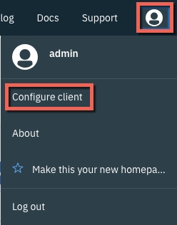

Lab - Deploy a Simple Helm Chart: NodeJS Sample
---

### Table of contents
[1. Create a new Namespace](#namespace)

[2. Deploy the NodeJS Helm Chart using the ICP Console](#consoleDeploy)

[3. Deploy the NodeJS Helm Chart using the Helm CLI](#cmdDeploy)

## Overview
In this lab exercise you will deploy a sample NodeJS Helm Chart.

### Create a new Namespace 
In this section you will create a new namespace to deploy the Helm Charts in to.

If you aren't already logged in to the ICP Admin Console from a previous exercise, open a browser and navigate to `https://<icp_master_ip>/8443` and log in using `username: admin` and `password: admin`

Click **Menu** and then select **Manage > Namespaces** to navigate to the Namespaces page.

Create a new Namespace named **helm-lab**

### Deploy the NodeJS Helm Chart using the ICP Console 
Click **Catalog** from the ICP Admin Console menu bar to navigate to the Catalog of Helm Charts

Type **nodejs** in to the **Search** box to locate the NodeJS sample

Click on the **ibm-nodejs-sample** entry in the Catalog to display the readme file. Take a moment to review the readme file for the Helm Chart. This sample is a NodeJS application that runs in a NodeJS Docker Container. The source for the application (and the Helm Chart) can be found here: https://github.com/ibm-developer/icp-nodejs-sample

Click **Configure**

When the *Configuration* screen is displayed, enter the following information (accept the defaults for all other values) and click **Install**:

| Parameter       | Value |
| ------------- |-------------|
| Release name     | nodejs-sample |
| Target namespace      | helm-lab      |
| I have read and agreed to the License Agreements | yes      |
| Image tag | 8     |

When the *Installation Started* dialog is displayed, click **Return to Catalog**

Click **Menu** and then select **Workloads > Helm Resleases** to navigate to the Helm Releases page.

Type **nodejs-sample** in the **Search** box to locate the Helm Chart you just deployed

### Deploy the NodeJS Helm Chart using the Helm CLI 
If you aren't already logged in to the ICP Admin Console from a previous exercise, open a browser and navigate to `https://<icp_master_ip>/8443` and log in using `username: admin` and `password: admin`

Click the **User** icon on the navigation bar and then select **Configure Client** to display the commands that are used to configure a kubectl command line to connect to this ICP Cluster.

## End of Lab Exercise
