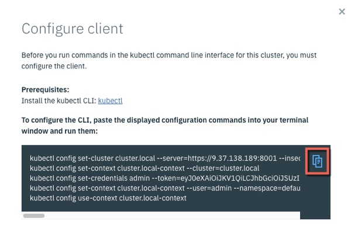

Lab - Install CLI and Tools
---

### Table of contents
[1. Install kubcetl](#kubectl)

[2. Configure kubectl to connect to your ICP Cluster](#connect)

## Overview
In this lab exercise you will install the IBM Cloud Private CLI and other useful tools.

### Install kubectl <a name="kubectl"></a>
In a **terminal** session connected to your `master` node as the **root** user issue the following command to install the `kubectl` Kubernetes CLI

```
docker run -e LICENSE=accept --net=host -v /usr/local/bin:/data ibmcom/icp-inception:2.1.0.2-ee cp /usr/local/bin/kubectl /data
```

### Configure kubectl to connect to your ICP Cluster <a name="connect"></a>
If you aren't already logged in to the ICP Admin Console from a previous exercise, open a browser and navigate to `https://<icp_master_ip>/8443` and log in using `username: admin` and `password: admin`

Click the **User** icon on the navigation bar and then select **Configure Client** to display the commands that are used to configure a kubectl command line to connect to this ICP Cluster.


When the **Configure client** dialog is displayed, click the copy commands icon as shown below:



Return to the terminal window and paste in the commands. The output will be similar to that shown below:

```
# kubectl config set-cluster cluster.local --server=https://9.37.138.189:8001 --insecure-skip-tls-verify=true
Cluster "cluster.local" set.

# kubectl config set-context cluster.local-context --cluster=cluster.local
Context "cluster.local-context" created.

# kubectl config set-credentials admin --token=...
User "admin" set.

# kubectl config set-context cluster.local-context --user=admin --namespace=default
Context "cluster.local-context" modified.

# kubectl config use-context cluster.local-context
Switched to context "cluster.local-context".
```

Issue the following command to get information about your ICP Cluster: `kubectl cluster-info`

```
# kubectl cluster-info
Kubernetes master is running at https://9.37.138.189:8001
catalog-ui is running at https://9.37.138.189:8001/api/v1/namespaces/kube-system/services/catalog-ui:catalog-ui/proxy
Heapster is running at https://9.37.138.189:8001/api/v1/namespaces/kube-system/services/heapster/proxy
image-manager is running at https://9.37.138.189:8001/api/v1/namespaces/kube-system/services/image-manager:image-manager/proxy
KubeDNS is running at https://9.37.138.189:8001/api/v1/namespaces/kube-system/services/kube-dns:dns/proxy
metrics-server is running at https://9.37.138.189:8001/api/v1/namespaces/kube-system/services/https:metrics-server:/proxy
platform-ui is running at https://9.37.138.189:8001/api/v1/namespaces/kube-system/services/platform-ui:platform-ui/proxy

To further debug and diagnose cluster problems, use 'kubectl cluster-info dump'.
```

## End of Lab Exercise
