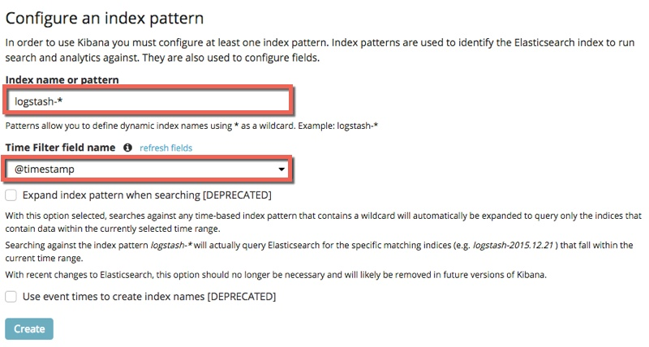
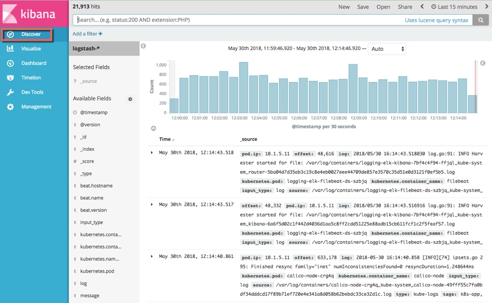
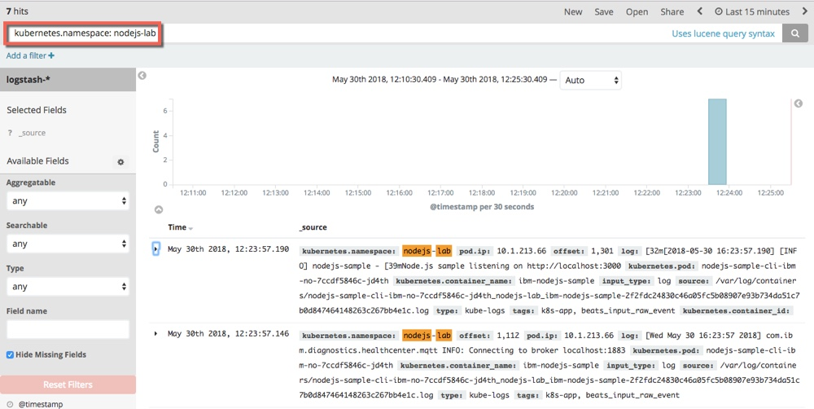

Lab - Logging
---

### Table of contents
[1. Introduction to kubectl logging commands](#kubcetl)

[2. Introduction to using Kibana](#intro)

## Overview
In this lab exercise you will gain some experience using **kubectl** to view logs and **Kibana** to review and analyze logs collected from your ICP Cluster

### Introduction to kubectl logging commands <a name="kubectl"></a>
In this section you will use kubcetl commands to view logs from your ICP CLUSTER

1. If you don't already have one open, open a **terminal** session connected to your `master` node as the **root** user

2. Configure the kubectl command line to connect to your ICP Cluster (Click the **User** icon on the navigation bar in the ICP Admin Console and then select **Configure Client** and copy the commands and paste them in to the terminal window

3. Enter the following command to view the logs for the nodejs sample that you deployed earlier in the workshop using the **Deployment**.

  ```
  kubectl logs deployment/nodejs-sample-cli-ibm-no --namespace nodejs-lab
  ```

  The output will be similar to the output shown below:

  ```
  # kubectl logs deployment/nodejs-sample-cli-ibm-no --namespace nodejs-lab

  > nodejs-sample@1.0.0 start /app
  > node server/server.js

  [Wed May 30 16:23:56 2018] com.ibm.diagnostics.healthcenter.loader INFO: Node Application Metrics 3.1.3.201711070422 (Agent Core 3.2.6)
  [2018-05-30 16:23:57.135] [INFO] ibm-cloud-env - Initializing with /app/server/config/mappings.json
  [2018-05-30 16:23:57.138] [WARN] ibm-cloud-env - File does not exist /app/server/config/mappings.json
  [Wed May 30 16:23:57 2018] com.ibm.diagnostics.healthcenter.mqtt INFO: Connecting to broker localhost:1883
  [2018-05-30 16:23:57.190] [INFO] nodejs-sample - Node.js sample listening on http://localhost:3000

  ```

4. Another way to access the same logs is by using the **app label**. Enter the following command to view the logs for the nodejs sample that you deployed earlier in the workshop using the **app label**.

  ```
  kubectl logs -lapp=nodejs-sample-cli-ibm-no-selector --namespace=nodejs-lab
  ```

5. Another way to access the same logs is by using the **pod name**. Enter the following commands to get the pod name and then get the logs for the pod.

  ```
  export PODNAME=$(kubectl get pods -l app=nodejs-sample-cli-ibm-no-selector --namespace=nodejs-lab -o=jsonpath="{.items[0].metadata.name}")

  kubectl logs $PODNAME --namespace=nodejs-lab
  ```

### Introduction to using Kibana <a name="intro"></a>
In this section you will use Kibana to review infrastructure and application logs and create some simple charts and graphs

#### Access Kibana
Kibana was installed in the **kube-system** namespace during IBM Cloud Private installation and integrated in to the ICP Admin Console.

1. If you aren't already logged in to the ICP Admin Console from a previous exercise, open a browser and navigate to `https://<icp_master_ip>/8443` and log in using `username: admin` and `password: admin`

2. Click **Menu** and then select **Platform > Logging** to access Kibana.

#### Configure an Index Pattern
When you first access the Kibana GUI you are prompted to create an Index Pattern which is used to access data in ElasticSearch.

1. The **Index name or pattern** defaults to `logstash-*`. Select `@timestamp` from the **Time Filter field name** drop-down and click **Create**

  

2. Click **Discover** on the left-side menu to run a default query against ElasticSearch for all log messages that have been generated in the last 15 minutes

  

3. In the search box, enter ```kubernetes.namespace: nodejs-lab``` to see the logs for the nodejs sample

  

## End of Lab Exercise
