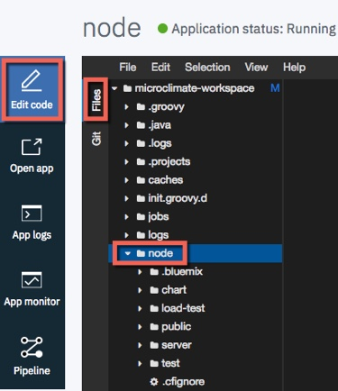

Lab - Microclimate
---

### Table of contents
[1. Configure ICP for Microclimate](#configure)

[2. Deploy the Microclimate Helm Chart](#deploychart)

[3. Import an example project in to Microclimate](#import)

[4. Create a Jenkins pipeline for the project](#jenkins)

## Overview
In this lab exercise you will install **microclimate** in to your ICP Cluster and then work through developing applications from scratch and importing existing applications

### Configure ICP for Microclimate <a name="configure"></a>
In this section you will configure the environment for Microclimate

#### Create Docker secret and patch service account

1. In a **terminal** session connected to your `master` node as the **root** user issue the following command to create a Docker registry secret in the default namespace:

   ```
   kubectl create secret docker-registry microclimate-registry-secret \
     --docker-server=mycluster.icp:8500 \
     --docker-username=admin \
     --docker-password=admin \
     --docker-email=null
   ```

2. Issue the following command to patch the service account

    ```
    kubectl patch serviceaccount default -p '{"imagePullSecrets": [{"name": "microclimate-registry-secret"}]}'
    ```

#### Create Helm secret

1. Issue the following commands to login to ICP and initialize Helm

    ```
    cd /root

    bx pr login -a https://<icp_master_ip>:8443 --skip-ssl-validation
    ```

2. Issue the following command to create the Helm secret required by microclimate

    ```
    kubectl create secret generic microclimate-helm-secret \
    --from-file=cert.pem=.helm/cert.pem \
    --from-file=ca.pem=.helm/ca.pem \
    --from-file=key.pem=.helm/key.pem
    ```


#### Create Persistant Volumes (PV) and Persistant Volume Claims (PVC)
Microclimate requires two PVCs to function; one to store workspace data and another for Jenkins. The following steps will walk you through the process of creating the PV and PVC.

**Note**: In this lab environment, the NFS Server is running on the icp-proxy node. In a *real* environment a dedicated NFS Server will probably exist.

1. In a **terminal** session connected to your `proxy` node as the **root** user issue the following command to create the directories that will be mapped to the PV

    ```
    cd /storage

    mkdir mc-workspace

    mkdir mc-jenkins

    chmod 777 mc*
    ```

**Note:** These are the only commands you will enter on the `proxy` node in this exercise. All subsequent commands will be entered on the `master` node.

2. In a **terminal** session connected to your `master` node as the **root** user, copy the following PV definition in to a file named `mc-worspace-pv.yaml` and change the **server IP address** (9.37.138.12) to the correct one for your environment.

    ```
    apiVersion: v1
    kind: PersistentVolume
    metadata:
      name: microclimate-workspace
    spec:
      accessModes:
        - ReadWriteOnce
      persistentVolumeReclaimPolicy: Retain
      capacity:
        storage: 2Gi
      nfs:
        path: /storage/mc-workspace
        server: 9.37.138.12
    ```

3. Copy the following PV definition in to a file named `mc-jenkins-pv.yaml` and change the **server IP address** (9.37.138.12) to the correct one for your environment.

    ```
    apiVersion: v1
    kind: PersistentVolume
    metadata:
      name: microclimate-jenkins
    spec:
      accessModes:
        - ReadWriteOnce
      persistentVolumeReclaimPolicy: Retain
      capacity:
        storage: 8Gi
      nfs:
        path: /storage/mc-jenkins
        server: 9.37.138.12
    ```

4. Copy the following PVC definition in to a a file named `mc-worspace-pvc.yaml`

    ```
   kind: PersistentVolumeClaim
   apiVersion: v1
   metadata:
     name: mc-workspace-pvc
   spec:
     accessModes:
       - ReadWriteOnce
     resources:
       requests:
         storage: 2Gi
    ```

5. Copy the following PVC definition in to a file named `mc-jenkins-pvc.yaml`

    ```
   kind: PersistentVolumeClaim
   apiVersion: v1
   metadata:
     name: mc-jenkins-pvc
   spec:
     accessModes:
       - ReadWriteOnce
     resources:
       requests:
         storage: 8Gi
    ```

6. Create the Persistent Volumes and Persistent Volume Claims using the following commands:

   ```
   kubectl create -f ./mc-workspace-pv.yaml

   kubectl create -f ./mc-jenkins-pv.yaml

   kubectl create -f ./mc-worspace-pvc.yaml

   kubectl create -f ./mc-jenkins-pvc.yaml
   ```

7. Verify that the PVC have successfuly **Bound** to the PV by issuing the following command:

`kubectl get pvc -n default`

```
# kubectl get pvc -n default
NAME               STATUS    VOLUME                 CAPACITY   ACCESS MODES   STORAGECLASS   AGE
mc-jenkins-pvc     Bound     microclimate-jenkins   8Gi        RWO                      1m
mc-workspace-pvc   Bound     mc-workspace           2Gi        RWO                     23s
```

### Deploy the Microclimate Helm Chart <a name="deploychart"></a>
In this section you will deploy the Microclimate Helm Chart using the IBM Admin console

1. Click **Catalog** from the ICP Admin Console menu bar to navigate to the Catalog of Helm Charts and search for the `ibm-microclimate` chart.

2. Click on the chart, read the overview and then click **Configure.**

3. Enter the following information (accept the defaults for all other values) and click **Install**:

  | Parameter       | Value |
  | ------------- |-------------|
  | Release name  | microclimate |
  | Target namespace  | default (Note: must be default) |
  | I have read and agreed to the License Agreements | yes |

  In the **Persistence** section:

  | Parameter       | Value |
  | ------------- |-------------|
  | Existing PersistentVolumeClaim Name | mc-workspace-pvc |
  | Dynamic Provisioning | no |

  In the **Microclimate** section:
  **NOTE**: You must change the Jenkins hostname value to include your icp-proxy-ip address for instance: microclimate.9.37.138.12.nip.io

  | Parameter       | Value |
  | ------------- |-------------|
  | Microclimate hostname | microclimate.icp-proxy-ip.nip.io |

  In the **Jenkins** section:
  **NOTE**: You must change the Jenkins hostname value to include your icp-proxy-ip address for instance: jenkins.9.37.138.12.nip.io

  | Parameter       | Value |
  | ------------- |-------------|
  | Jenkins hostname | jenkins.icp-proxy-ip.nip.io |
  | Jenkins - Existing PersistentVolumeClaim Name | mc-jenkins-pvc |

5. You can monitor the status of your deployment from the CLI. Issue the following command `kubectl get po`

Note: It may take up to 5 minutes to get a **Running** status for all of the microclimate pods

```
# kubectl get po

NAME                                                    READY     STATUS    RESTARTS   AGE
microclimate-ibm-microclimate-64cf96cc75-tlm6r          3/3       Running   0          6m
microclimate-ibm-microclimate-devops-86db55bd57-v76hd   1/1       Running   0          6m
microclimate-jenkins-56766f9b49-slxtw                   1/1       Running   0          6m
```

6. Once all the pods are running you can open a browser tab and navigate to http://microclimate.icp-proxy-ip.nip.io (replace icp-proxy-ip with your ICP Proxy IP Address for instance: microclimate.9.37.138.12.nip.io)

7. Read and accept the Microclimate license agreement and click **Accept**.


### Import and test an example project in to Microclimate <a name="import"></a>
In this section you will import an example NodeJS microservice project in to Microclimate.

1. Select Import Project

2. Enter "https://github.com/microclimate-demo/node" in Git field and click **Next**.

3. Verify that **Authentication required is not selected** and click **Import**.

4. Once the project has been imported, the **Microclimate Dashboard** will be displayed. Click **Files** as shown below and open the **node** folder

    

5. Using the File Viewer, open `/node/public` and `/node/server` and review the source code for the sample application.

6. Open the `health` endpoint (`/node/server/routers/health.js`) and note that it simply replies with `status: UP` whenever invoked. This endpoint is used by Kubernetes to determine whether the application is up and running or not.

    

7. Open `/node/public/index.html` and note that the page replies with a simple message. You will change this message later in the lab exercise

    

8. Open `/node/Dockerfile` and note that the Dockerfile first uses package.json to define the dependencies and later copies the application files in to the `/app` folder on the nodejs image  

    

9. Open `/node/Jenkinsfile` and note that Jenkins will use the IBM provided and maintained `MicroserviceBuilder` library to handle the deployment

    

10. By now the sample application should have been automatically deployed and started by Microclimate and the status in the top left of the screen should now by **Running**. If the status is still **Not running**, just wait a little longer...

    

11. Click on **App Logs** to display the logs from the running container

    

12. Click on **Open app** to open the application in a new browser tab

    

13. Close the browser tab and return to the Microclimate dashboard. Click on **Edit code** and return to the `/node/public/index.html` file. Change the `Hello world! This is a StarterKit` line to a different value and save your changes.

    

14. After a few seconds you should see the application status change to `Not running` and then soon after that back to `Running`. Microclimate has deployed the change to ICP. Click on **Open app** and view your change. Note that the Application URL has changed to use a new Port.

    

15. Close the browser tab and return to the Microclimate dashboard. Click on the **Run Load** button in the top right corner of the page to start a **Load Test**

16. Click on **App monitor** to open the application monitoring page. After a few seconds requests will start to be processed by the application and show in the graphs. The load test will run for a short time.

    

15. Return to the **ICP Admin Console** and locate the **Deployment** and **Service** for your application, note the **namespace** that they are deployed to.

### Create a Jenkins pipeline for the project <a name="jenkins"></a>

1. Return to the Microclimate Dashboard and click on **Pipeline**.

    

2. Click **Create pipeline**

3. Enter https://github.com/microclimate-demo/node in the Repository location field.

4. Click **Create pipeline**.

5. You should now see the message "The pipeline has been configured for this project". Click **Open pipeline**.

6. You may be shown the ICP Admin Console login page, login using **admin/admin**

7. Once logged in, you should be routed to Jenkins and see a build in progress. Select the **Master** deployment.

7. Monitor the Stage view until the build is complete. There will be three stages Extract, Docker build and Deploy. This make take up to 5 minutes to complete.

    

8. Once the build process has completed. Return to the ICP Admin Console and locate the newly created **Deployment** and **Service**. Note the different namespace.

9. Use the **Launch** button on new Deployment to open a browser tab to the application.

10. Close the browser tabs for the **application** and the **Microclimate Dashboard**

#### End of Lab Review
In this lab exercise you have been introduced to Microclimate in IBM Cloud Private:
- Configured IBM Cloud Private for Microclimate and deployed the Microclimate Helm Chart
- Imported, reviewed and tested an example cloud-native application
- Created a Jenkins Pipeline and deployed the application to IBM Cloud Private

## End of Lab Exercise
