Lab - Configuring IBM Cloud Private to use OpenLDAP
---

### Table of contents
[1. Deploying and Testing OpenLDAP](#deploytest)

[2. Integrate IBM Cloud Private with OpenLDAP](#integrate)

[3. Dashboard](#dashboard)

## Overview
In this lab exercise you will deploy to IBM Cloud Private a standalone OpenLDAP Docker Container that has been pre-configured with some users and groups. Later, you will configure IBM Cloud Private to use the OpenLDAP instance that you deployed.

<u>Once the OpenLDAP server is up and running the ldap schema looks like this:</u>

> **<u>OU=Users</u>**
>
> 		​todd
>
> 		​james
>
> 		​sarah
>
> 		​bob
>
> 		​laura
>
> 		​josie
>
> 		​carlos
>
> 		​jackie
>
> 		​tony
>
> **<u>OU=Groups</u>**
>
> 		​<u>developers</u>
>
> 				​todd
>
> 				​james
>
> 				​sarah
>
> 		​<u>operations</u>
>
> 				​bob
>
> 				​laura
>
> 				​josie
>
> 		​<u>support</u>
>
> 				​carlos
>
> 				​jackie
>
> 				​tony

*Note: The default password for all users is: Passw0rd*

*Note: This is not intented to be a production LDAP server, it is only being used as an example for integrating ICP with a LDAP server and testing RBAC concepts.*

> **If you would like to build your own openldap docker image based on this image you can find the source code here**: https://github.com/jdiggity22/openldap


### Deploying and Testing OpenLDAP <a name="deploytest"></a>
In this section you will create a Kubernetes **Deployment** and a Kubernetes **Service** for the OpenLDAP container. Once the container is running you will access the container from a command line and issue some LDAP queries.

1. If you don't already have one open, open a **terminal** session connected to your `master` node as the **root** user

2. Configure the kubectl command line to connect to your ICP Cluster (Click the **User** icon on the navigation bar in the ICP Admin Console and then select **Configure Client** and copy the commands and paste them in to the terminal window

3. Copy the following **Deployment** definition in to a file named `openldap-deployment.yaml`

    ```
    apiVersion: apps/v1
    kind: Deployment
    metadata:
      name: ldap
      labels:
        app: ldap
    spec:
      replicas: 1
      selector:
        matchLabels:
          app: ldap
      template:
        metadata:
          labels:
            app: ldap
        spec:
          containers:
            - name: ldap
              image: johnowebb/openldap:latest
              ports:
                - containerPort: 389
                  name: openldap

    ```

4. Copy the following **Service** definition in to a file named **openldap-service.yml**

    ```
    apiVersion: v1
    kind: Service
    metadata:
      labels:
        app: ldap
      name: ldap-service
    spec:
      ports:
        - port: 389
      selector:
        app: ldap
    ```

4. Excute the following kubectl commands to create the **Deployment** and **Service**:

  `kubectl create -f ./openldap-deployment.yml`

  `kubectl create -f ./openldap-service.yml`

  Example output
  ```
  # kubectl create -f ./openldap-deployment.yml
  deployment.apps "ldap" created
  # kubectl create -f ./openldap-service.yml
  service "ldap-service" created
  ```

5. Verify the pod is running with the following command:

  `kubectl get po`

  Example output

  ```
  # kubectl get po
  NAME                    READY     STATUS    RESTARTS   AGE
  ldap-64745886dd-ljfdr   1/1       Running   0          2m
  ```

6. Using the **pod name** from the previous command issue the following command to **describe the pod**:

   `kubectl describe po <pod_name>`

   Example output

  ```
  # kubectl describe po ldap-64745886dd-ljfdr
  Name:           ldap-64745886dd-ljfdr
  Namespace:      default
  Node:           pit-icp-worker-02/172.16.3.24
  Start Time:     Thu, 10 May 2018 23:56:31 -0400
  Labels:         app=ldap
                  pod-template-hash=2030144288
  Annotations:    kubernetes.io/psp=default
  Status:         Running
  IP:             10.1.99.197
  Controlled By:  ReplicaSet/ldap-64745886dd
  Containers:
    ldap:
      Container ID:   docker://b82c6ee4983e8c664b07ac06a2773639de30e18e3fc23a356649cb2752d689a5
      Image:          johnowebb/openldap:latest
      Image ID:       docker-pullable://johnowebb/openldap@sha256:1fa63e2849d7a75389beedbdcd660e46029d6a777c9ac22f01693076910164a2
      Port:           389/TCP
      Host Port:      0/TCP
      State:          Running
        Started:      Thu, 10 May 2018 23:56:46 -0400
      Ready:          True
      Restart Count:  0
      Environment:    <none>
      Mounts:
        /var/run/secrets/kubernetes.io/serviceaccount from default-token-2sn5d (ro)
  Conditions:
    Type           Status
    Initialized    True
    Ready          True
    PodScheduled   True
  Volumes:
    default-token-2sn5d:
      Type:        Secret (a volume populated by a Secret)
      SecretName:  default-token-2sn5d
      Optional:    false
  QoS Class:       BestEffort
  Node-Selectors:  <none>
  Tolerations:     node.kubernetes.io/not-ready:NoExecute for 300s
                   node.kubernetes.io/unreachable:NoExecute for 300s
  Events:
    Type    Reason                 Age   From                        Message
    ----    ------                 ----  ----                        -------
    Normal  Scheduled              5m    default-scheduler           Successfully assigned ldap-64745886dd-ljfdr to pit-icp-worker-02
    Normal  SuccessfulMountVolume  5m    kubelet, pit-icp-worker-02  MountVolume.SetUp succeeded for volume "default-token-2sn5d"
    Normal  Pulling                5m    kubelet, pit-icp-worker-02  pulling image "johnowebb/openldap:latest"
    Normal  Pulled                 5m    kubelet, pit-icp-worker-02  Successfully pulled image "johnowebb/openldap:latest"
    Normal  Created                5m    kubelet, pit-icp-worker-02  Created container
    Normal  Started                5m    kubelet, pit-icp-worker-02  Started container
  ```

7. Enter the following command to get the **Cluster IP** that has been assigned to the **Service**. You will use this value later in the lab Exercise

  `kubectl describe service ldap-service`

  Example output (in this case the **Cluster IP** is **10.0.0.2**):

  ```
  # kubectl describe service ldap-service
  Name:              ldap-service
  Namespace:         default
  Labels:            app=ldap
  Annotations:       <none>
  Selector:          app=ldap
  Type:              ClusterIP
  IP:                10.0.0.2
  Port:              <unset>  389/TCP
  TargetPort:        389/TCP
  Endpoints:         10.1.116.198:389
  Session Affinity:  None
  Events:            <none>
  ```


8. In order to verify that the ldap server is responding and that the ldap user and groups are available, you will now connect to the pod with an interactive shell using the following command:

   `kubectl exec <pod_name> -it bash`

   Example output (note that you are now inside the container as the root user):

   ```
   # kubectl exec ldap-6b4898575b-q9qrw -it bash
   root@ldap-6b4898575b-q9qrw:/#

   ```

9. Now execute the following command to perform an **ldapsearch**:

  `ldapsearch -x -h localhost -b dc=ibm,dc=com -D "cn=admin,dc=ibm,dc=com" -w Passw0rd`

	Example output

  ```
  # extended LDIF
  #
  # LDAPv3
  # base <dc=ibm,dc=com> with scope subtree
  # filter: (objectclass=*)
  # requesting: ALL
  #

  # ibm.com
  dn: dc=ibm,dc=com
  objectClass: top
  objectClass: dcObject
  objectClass: organization
  o: IBM
  dc: ibm

  # admin, ibm.com
  dn: cn=admin,dc=ibm,dc=com
  objectClass: simpleSecurityObject
  objectClass: organizationalRole
  cn: admin
  description: LDAP administrator
  userPassword:: e1NTSEF9bitWdGJvZ2RIcXhNbTVDM0tZNTZrY1ByTHcxWHJQM0U=

  # users, ibm.com
  dn: ou=users,dc=ibm,dc=com
  objectClass: organizationalUnit
  description: All users in organization
  ou: users

  # groups, ibm.com
  dn: ou=groups,dc=ibm,dc=com
  objectClass: organizationalUnit
  objectClass: top
  ou: groups

  # todd, users, ibm.com
  dn: uid=todd,ou=users,dc=ibm,dc=com
  objectClass: inetOrgPerson
  objectClass: organizationalPerson
  objectClass: person
  objectClass: top
  cn: toddCN
  sn: toddSN
  uid: todd
  userPassword:: UGFzc3cwcmQ=

  # james, users, ibm.com
  dn: uid=james,ou=users,dc=ibm,dc=com
  objectClass: inetOrgPerson
  objectClass: organizationalPerson
  objectClass: person
  objectClass: top
  cn: jamesCN
  sn: jamesSN
  uid: james
  userPassword:: UGFzc3cwcmQ=

  # sarah, users, ibm.com
  dn: uid=sarah,ou=users,dc=ibm,dc=com
  objectClass: inetOrgPerson
  objectClass: organizationalPerson
  objectClass: person
  objectClass: top
  cn: sarahCN
  sn: sarahSN
  uid: sarah
  userPassword:: UGFzc3cwcmQ=

  # bob, users, ibm.com
  dn: uid=bob,ou=users,dc=ibm,dc=com
  objectClass: inetOrgPerson
  objectClass: organizationalPerson
  objectClass: person
  objectClass: top
  cn: bobCN
  sn: bobSN
  uid: bob
  userPassword:: UGFzc3cwcmQ=

  # laura, users, ibm.com
  dn: uid=laura,ou=users,dc=ibm,dc=com
  objectClass: inetOrgPerson
  objectClass: organizationalPerson
  objectClass: person
  objectClass: top
  cn: lauraCN
  sn: lauraSN
  uid: laura
  userPassword:: UGFzc3cwcmQ=

  # josie, users, ibm.com
  dn: uid=josie,ou=users,dc=ibm,dc=com
  objectClass: inetOrgPerson
  objectClass: organizationalPerson
  objectClass: person
  objectClass: top
  cn: josieCN
  sn: josieSN
  uid: josie
  userPassword:: UGFzc3cwcmQ=

  # carlos, users, ibm.com
  dn: uid=carlos,ou=users,dc=ibm,dc=com
  objectClass: inetOrgPerson
  objectClass: organizationalPerson
  objectClass: person
  objectClass: top
  cn: carlosCN
  sn: carlosSN
  uid: carlos
  userPassword:: UGFzc3cwcmQ=

  # jackie, users, ibm.com
  dn: uid=jackie,ou=users,dc=ibm,dc=com
  objectClass: inetOrgPerson
  objectClass: organizationalPerson
  objectClass: person
  objectClass: top
  cn: jackieCN
  sn: jackieSN
  uid: jackie
  userPassword:: UGFzc3cwcmQ=

  # tony, users, ibm.com
  dn: uid=tony,ou=users,dc=ibm,dc=com
  objectClass: inetOrgPerson
  objectClass: organizationalPerson
  objectClass: person
  objectClass: top
  cn: tonyCN
  sn: tonySN
  uid: tony
  userPassword:: UGFzc3cwcmQ=

  # developers, groups, ibm.com
  dn: cn=developers,ou=groups,dc=ibm,dc=com
  objectClass: groupOfUniqueNames
  objectClass: top
  cn: developers
  uniqueMember: uid=todd,ou=users,dc=ibm,dc=com
  uniqueMember: uid=james,ou=users,dc=ibm,dc=com
  uniqueMember: uid=sarah,ou=users,dc=ibm,dc=com

  # operations, groups, ibm.com
  dn: cn=operations,ou=groups,dc=ibm,dc=com
  objectClass: groupOfUniqueNames
  objectClass: top
  cn: operations
  uniqueMember: uid=bob,ou=users,dc=ibm,dc=com
  uniqueMember: uid=laura,ou=users,dc=ibm,dc=com
  uniqueMember: uid=josie,ou=users,dc=ibm,dc=com

  # support, groups, ibm.com
  dn: cn=support,ou=groups,dc=ibm,dc=com
  objectClass: groupOfUniqueNames
  objectClass: top
  cn: support
  uniqueMember: uid=carlos,ou=users,dc=ibm,dc=com
  uniqueMember: uid=jackie,ou=users,dc=ibm,dc=com
  uniqueMember: uid=tony,ou=users,dc=ibm,dc=com

  # readonly, ibm.com
  dn: cn=readonly,dc=ibm,dc=com
  cn: readonly
  objectClass: simpleSecurityObject
  objectClass: organizationalRole
  userPassword:: e1NTSEF9aWQybWxLSXB2dzlPcGVUUlkzRVBBQk1VWG1nd00rUnU=
  description: LDAP read only user

  # search result
  search: 2
  result: 0 Success

  # numResponses: 18
  # numEntries: 17
  ```

8. Type `exit` to close your interactive session.


### Integrate IBM Cloud Private with OpenLDAP <a name="integrate"></a>
In this section you will configure IBM Cloud Private to use the OpenLDAP server that you just deployed for Role Based Access Control (RBAC)

1. If you aren't already logged in to the ICP Admin Console from a previous exercise, open a browser and navigate to `https://<icp_master_ip>/8443` and log in using `username: admin` and `password: admin`

2. Click **Menu** and then select **Manage > Authentication**

3. When the **No LDAP connection found** message is displayed, click **Create LDAP Connection**

4. Enter the following details

   #### LDAP Connection

   - Name: `OpenLDAP`

   - Type: `Custom`

   - URL: `ldap://ip-of-ldap-service:389`  

     **Note:** You collected the ip-of-ldap-service earlier when you issued the  *kubectl describe service ldap-service* command.)

   #### LDAP authentication

   - Base DN: `dc=ibm,dc=com`
   - Bind DN: `cn=admin,dc=ibm,dc=com`
   - Admin Password: `Passw0rd`

   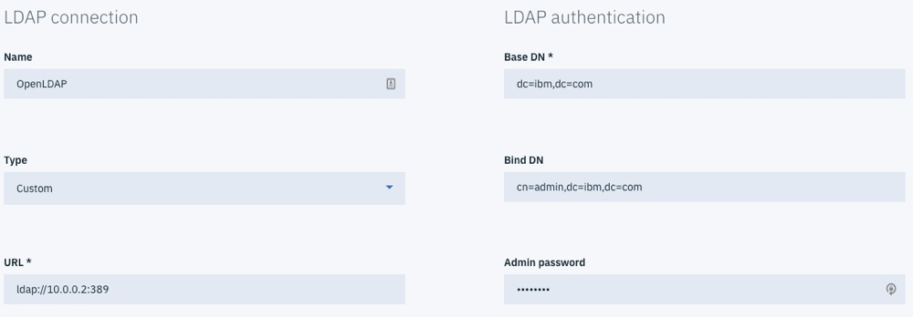

   #### LDAP Filters

   - Group filter: `(&(cn=%v)(objectclass=groupOfUniqueNames))`
   - User filter: `(&(uid=%v)(objectclass=inetOrgPerson))`
   - Group ID map: `*:cn`
   - User ID map: `*:uid`
   - Group member ID map: `groupOfUniqueNames:uniqueMember`

   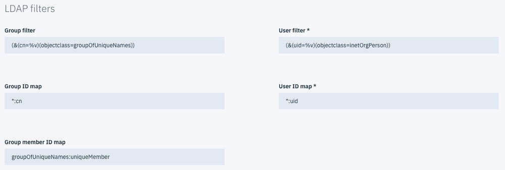


# Create Namespaces

To prevent our different groups from being able to view or modify each other's resources we will want to create some level of isolation. To do this we will create namespaces that we can associate with our Teams.

1. Execute the following commands to create ICP namespaces.

   ```
   kubectl create namespace developers

   kubectl create namespace operations

   kubectl create namespace support
   ```


# Create Teams

In the section we will work through the process of creating teams in ICP and assigning them roles. These teams will be based on the LDAP groups that were defined in out OpenLDAP container.

**Note:** Refer to the [Deploying OpenLDAP](./Day1_Lab2_Deploying_OpenLDAP.md ) lab for the LDAP schema reference.

1. Navigate to **Manage -> Teams** in the ICP browser interface.

2. Click **Create team**

3. Enter the team name *developers*

4. Select the developers group from the table below

   **Note:** The LDAP groups will not show up in the table below until a filter is applied. So to find the developers group type "d" on the search field and the groups that start with "d" will be populatd the table. If you want to

5. Grant the developer team ***Editor*** access.

6. Click **Create**.

7. Once the team is created select the team you created from the *Teams* list.

8. Navigate to the *Resources* tab.

9. Click **Add resources**

10. From the list of namespaces select *developers* and click **Add**.

Repeat the process to create two more teams with the values below.

| Team Name  | LDAP Group | Role     | Namespace  |
| ---------- | ---------- | -------- | ---------- |
| operations | operations | operator | operations |
| support    | support    | viewer   | support    |

# Validate the Users

In this section we are going to explore the differences between the groups we created. Follow the steps below to explore the differences between the roles assigned to the different groups.

1. Login as a user from each of the teams you defined and explore the differences between the different roles.
2. Create an empty ConfigMap object using each user

​	Are you able to see the config maps from other users?

​	Can you see any deployments?


### Log in to your ICP Admin Console <a name="login"></a>
If you aren't already logged in to the ICP Admin Console from a previous exercise, open a browser and navigate to `https://<icp_master_ip>/8443`

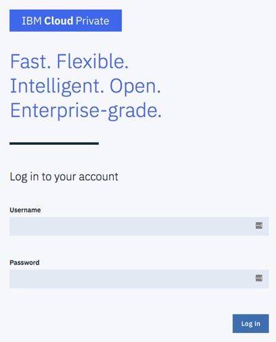

Log in using `username: admin` and `password: admin`

### Getting Started <a name="gettingstarted"></a>
The first screen that is displayed when you successfully log in is the **Getting Started** page.
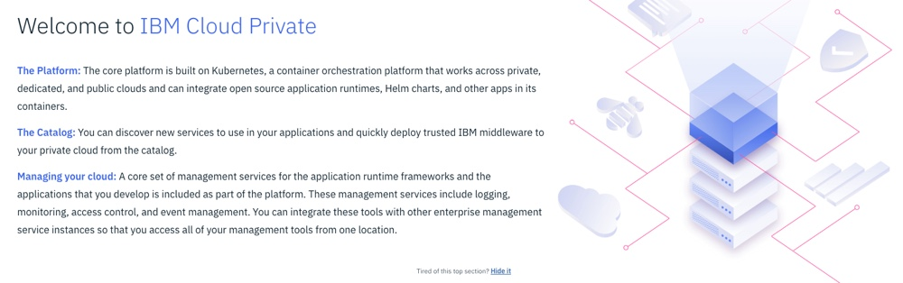

Locate the following information:

1. Which catalog item would you use if you want to **migrate an application that uses WebSphere Application Server**?

2. Which catalog item would you use if you want to **build a 12-factor microservice**?

3. What tool could you use to **chat with the team** if you have any issues?

### Dashboard <a name="dashboard"></a>
Click **Menu** (in the top left corner of the page) and then select **Dashboard** to navigate to the Dashboard page. The Dashboard page provides an overview of the current status of the ICP cluster.
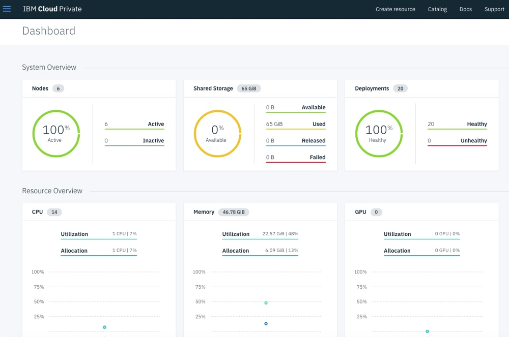

Locate the following information:

1. How many **Nodes** are in your ICP Cluster?

2. How much **Storage** is currently available in your ICP Cluster?

3. Are all of the **Deployments** in your ICP Cluster healthy?

### Nodes <a name="nodes"></a>
Click **Menu** and then select **Platform > Nodes** to navigate to the Nodes page. This page displays information about the nodes that are part of the ICP Cluster.
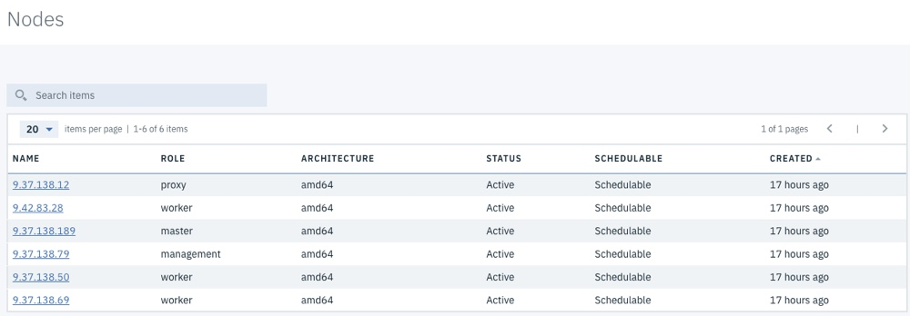

Note: Click the **command prompt** icon in the bottom right corner of the screen to see the command that a user would need to issue from the **Kubernetes CLI command prompt** to see the same information that has been displayed in the Administration Console.

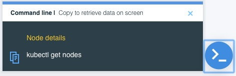

Click on the **Name** of the node to *drill down* and see more information about a node.
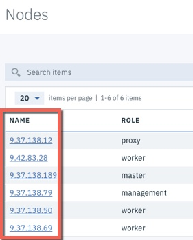

Locate the following information:

1. How many **Worker nodes** are in your cluster?

2. What is the **Architecture** of your master node?

3. How much **memory** does your proxy node have?

4. How many **CPUs** do each of your worker nodes have?

5. Which node is the **logging-elk-data-0** pod deployed to?

### Namespaces <a name="namespaces"></a>
Click **Menu** and then select **Manage > Namespaces** to navigate to the Namespaces page.

Users are assigned to organizational units called namespaces.
Namespaces are also known as tenants or accounts. In IBM Cloud Private, users are assigned to teams. You can assign multiple namespaces to a team. Users of a team are members of the team's namespaces.
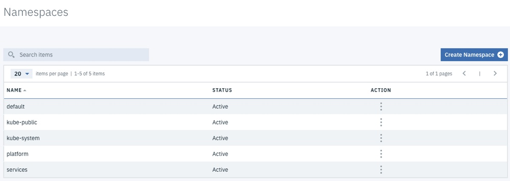

Locate the following information:

1. How many **namespaces** have been automatically created in your cluster during installation?

2. What **actions** are you able to take on namespaces?

### Helm Charts <a name="helmcharts"></a>
Click **Catalog** on the navigation bar to navigate to the Helm Chart Catalog page.


By using the Catalog, you can browse and install packages in your IBM Cloud Private cluster from Helm charts.

The Catalog displays Helm charts, which contain application packages that can run as Kubernetes services. The packages are stored in repositories. The Catalog in IBM Cloud Private contains connections to recommended repositories by default, but you can connect to other repositories. After you connect to a repository, you can access its charts from the Catalog. Application developers can also develop applications and publish them in the Catalog so that other users can easily access and install the applications.

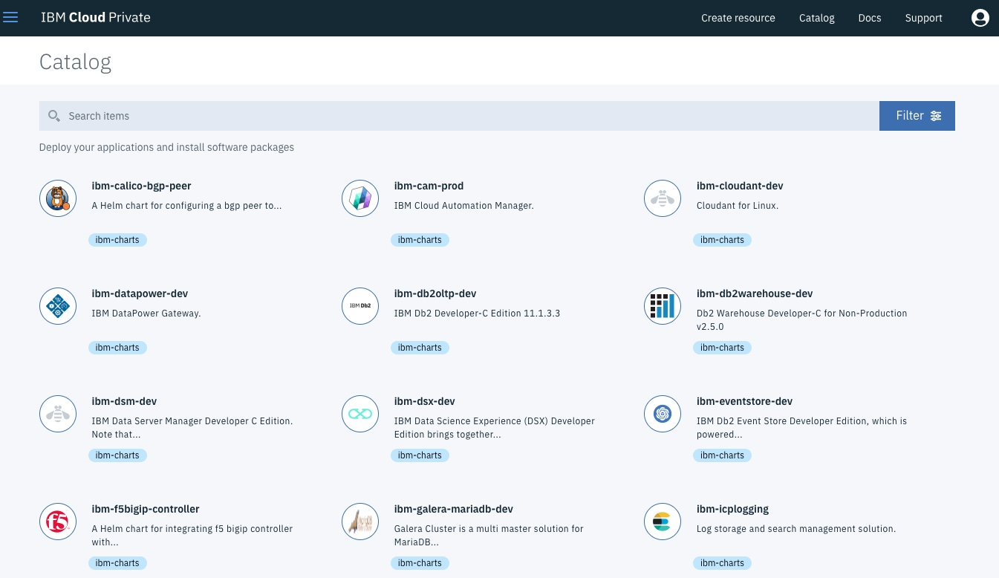

Note: Click on the Helm Chart name to view the readme file

Locate the following information:

1. What date was the **ibm-jenkins-dev** Helm chart released?

2. How many MQ servers does the **ibm-mq-advanced-dev** Helm chart deploy?

3. What type of server does the **ibm-swift-sample** Helm chart deploy the sample application on?

Click **Menu** and then select **Manage > Helm Repositories** to navigate to the list of configured Helm repositories page.

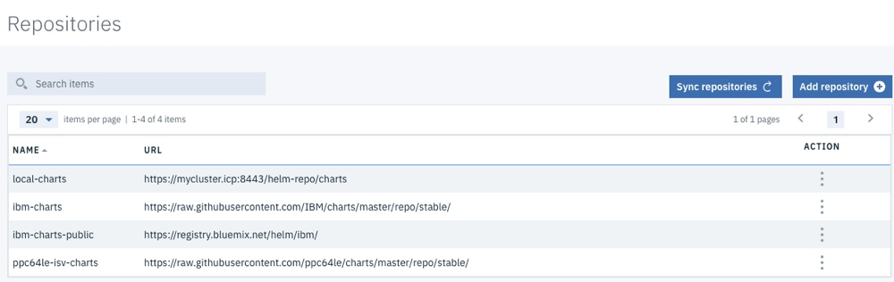

### Storage <a name="storage"></a>
Click **Menu** and then select **Platform > Storage** to navigate to the Storage page.

Data storage in a Kubernetes cluster is handled by using volumes. For Kubernetes, a PersistentVolume (PV) is a piece of networked storage in a cluster that is provisioned by an administrator. A PersistentVolumeClaim (PVC) is a request for storage that is made by a user.

In an IBM Cloud Private cluster, administrators can create PersistentVolumes that are available to all projects in the cluster. Users can then create PersistentVolumeClaims to request this resource for their application. All PersistentVolume types that are supported by Kubernetes are also supported by IBM Cloud Private.
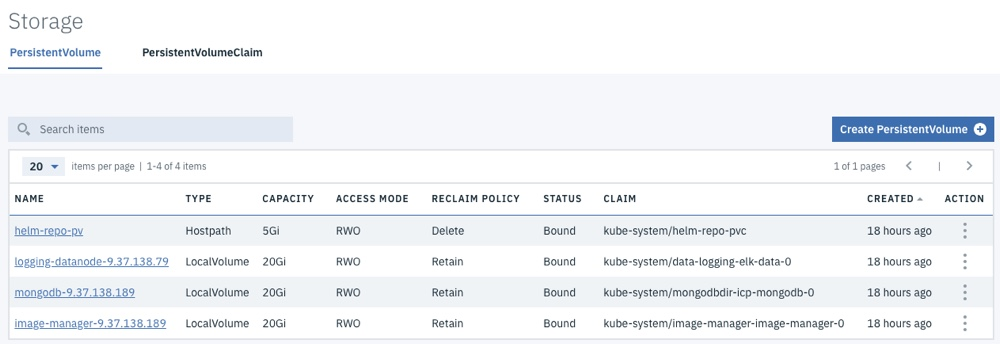

Click **PersistentVolumeClaim** to see the current Persistent Volume Claims in the ICP Cluster
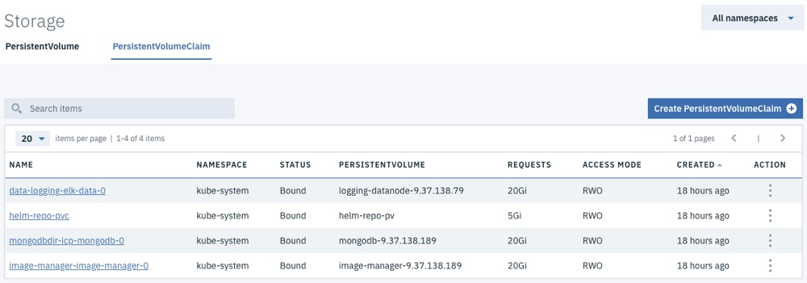

Locate the following information:

1. What is the capacity of the **helm-repo-pv** Persistent Volume?

2. What is the reclaim policy of the **mongodb** Persistent Volume?

3. What namespace is the **helm-repo-pvc** Persistent Volume Claim in?

### Monitoring <a name="monitoring"></a>
Click **Menu** and then select **Platform > Monitoring** to open Grafana in a new browser window.

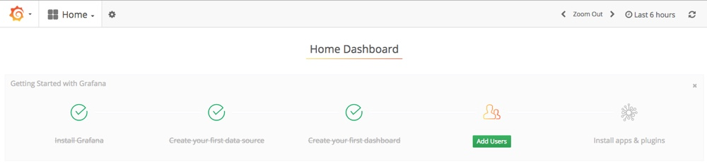

Click **Home** on the navigation bar and select **ICP 2.1 Performance IBM Provided 2.5** from the list to open the IBM provided Grafana page

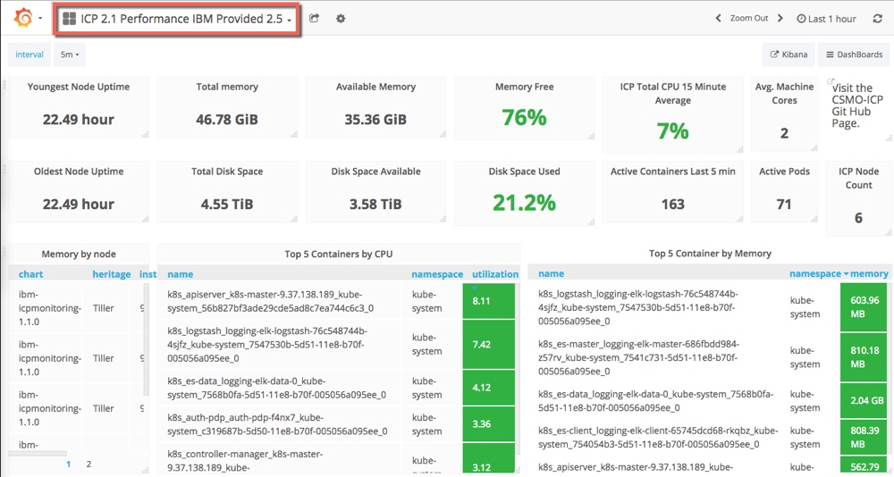

Locate the following information:

1. How many **active pods** are in your ICP cluster?

2. How much **memory** is available in your ICP cluster?

3. Which **pod** is using the most memory currently?

4. Which **pod** is using the most CPU currently?

Close the Grafana browser tab

### Alerts <a name="alerts"></a>
Click **Menu** and then select **Platform > Alerting** to open the ICP Alert Manager in a new browser tab.

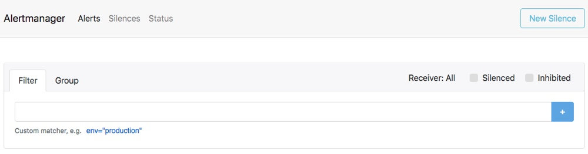

Locate the following information:

1. How many **Alerts** are configured in your ICP cluster?

Close the ICP Alert Manager tab.

### Deployments <a name="deployments"></a>
Click **Menu** and then select **Workloads > Deployments** to navigate to the Deployments page. A **Deployment controller** provides declarative updates for **Pods and ReplicaSets**. You describe a desired state in a Deployment object, and the Deployment controller changes the actual state to the desired state at a controlled rate. You can define Deployments to create new ReplicaSets, or to remove existing Deployments and adopt all their resources with new Deployments.

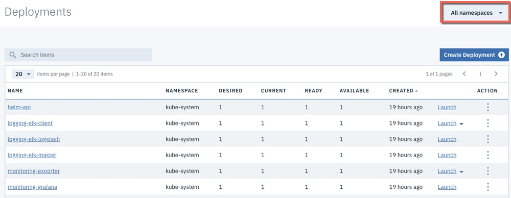

Notes:
1. Click on a Deployment Name to *drill down* and see more information such as the **Pods** that are part of the Deployment. Drill-down on a Pod to find out information about the Container and Logs

2. Use the **Namespace** drop down box in the top right corner of the page to change the Deployments that are displayed.

Locate the following information:

1. How many Deployments are in the **default** Namespace

2. How many **Pods** are part of the **helm-api** Deployment

3. Which **Containers** are part of the **helm-api** Deployment

4. Find the **Logs** for the **es-client** Container in the **logging-elk-client** Deployment

5. Which **Ports** are exposed on the **es-client** Container in the **logging-elk-client** Deployment

### StatefulSets <a name="statefulsets"></a>
Click **Menu** and then select **Workloads > StatefulSets** to navigate to the StatefulSets page. Like a Deployment, a StatefulSet manages Pods that are based on an identical container spec. Unlike a Deployment, a StatefulSet maintains a sticky identity for each of their Pods. These pods are created from the same spec, but are not interchangeable: each has a persistent identifier that it maintains across any rescheduling.

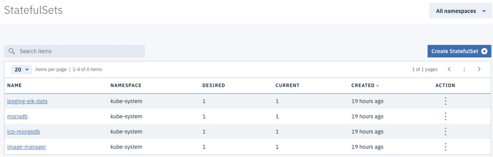

Locate the following information:

1. How many StatefulSets are in the **default** Namespace

2. How many **Pods** are part of the **icp-mongodb** StatefulSet

3. Which **Containers** are part of the **image-manager-0** StatefulSet

4. Find the **Logs** for the **iamge-manager* Container in the **image-manager-0** StatefulSet

### DaemonSets <a name="daemonsets"></a>
Click **Menu** and then select **Workloads > DaemonSets** to navigate to the DaemonSets page. A DaemonSet ensures that all (or some) Nodes run a copy of a Pod. As nodes are added to the cluster, Pods are added to them. As nodes are removed from the cluster, those Pods are garbage collected. Deleting a DaemonSet will clean up the Pods it created.

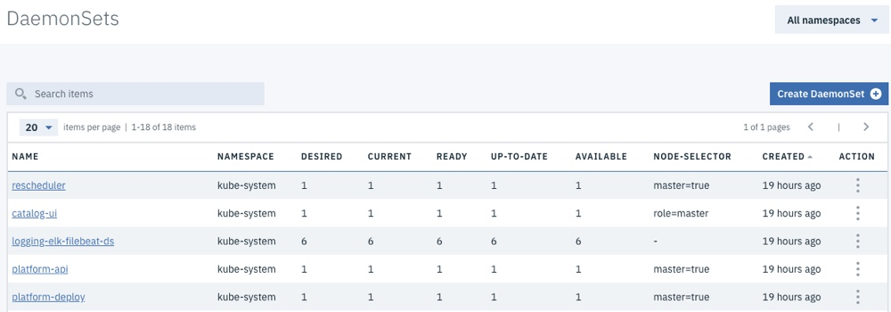

Locate the following information:

1. How many Nodes is the **calico-node** DaemonSet deployed to?

2. How many Nodes is the **rescheduler** DaemonSet deployed to?

3. How does Kubernetes know which Nodes to deploy a DaemonSet to?

### Services <a name="services"></a>
Click **Menu** and then select **Network Access > Services** to navigate to the Services page. Kubernetes Pods are mortal. They are born and when they die, they are not resurrected. ReplicaSets in particular create and destroy Pods dynamically (e.g. when scaling up or down). While each Pod gets its own IP address, even those IP addresses cannot be relied upon to be stable over time. This leads to a problem: if some set of Pods (let’s call them backends) provides functionality to other Pods (let’s call them frontends) inside the Kubernetes cluster, how do those frontends find out and keep track of which backends are in that set?

Enter **Services**.

A Kubernetes Service is an abstraction which defines a logical set of Pods and a policy by which to access them - sometimes called a micro-service. The set of Pods targeted by a Service is (usually) determined by a Label Selector.

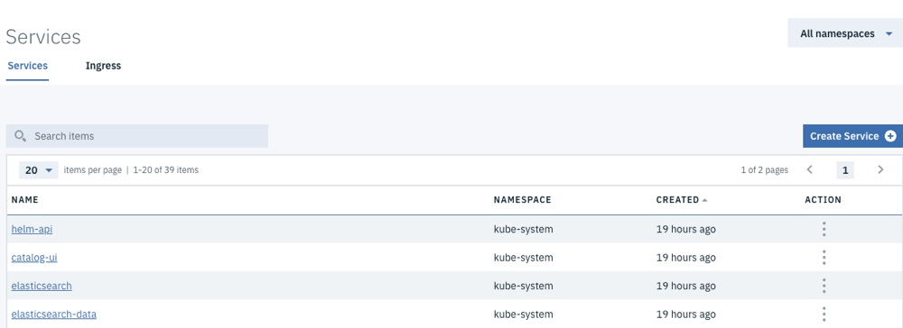

Note: Use the **Action** link next to a service to view more information than is displayed in the Admin Console

Locate the following information:

1. What is the **Label Selector** for the **helm-api** Service?

2. Which **Port** is the **monitoring-prometeus** Service exposing?

3. What is the **targetPort** for the **monitoring-prometeus** Service? (Hint: use the Action link to *drill down* on the Service)

4. In order to access the **monitoring-prometeus** Service would an application use the **Port** and **targetPort**?

5. Can you access a Service in an ICP Cluster from a browser running outside of the ICP Cluster network?

### Ingress <a name="ingress"></a>
Click **Ingress** to navigate to the Ingress page. An Ingress is an API object that manages external access to the services in a cluster, typically HTTP. Ingress can provide load balancing, SSL termination and name-based virtual hosting.

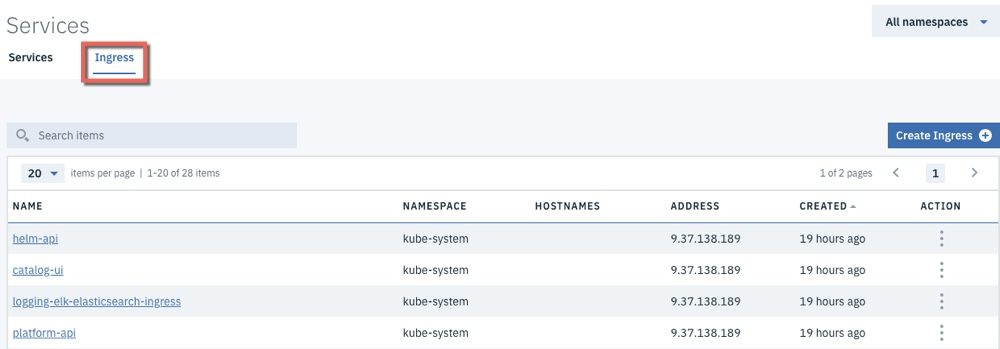

Locate the following information:

1. What **Path** is the **helm-api** Ingress configured to listen on? (Hint: use the Action link to *drill down* on the Ingress)

2. How does the **helm-api** Ingress locate the target **Pod**?

3. Can you access an Ingress in an ICP Cluster from a browser running outside of the ICP Cluster network?

### Command Line Parameters <a name="cmdline"></a>
Click the **User** icon on the navigation bar and then select **Configure Client** to display the commands that are used to configure a kubectl command line to connect to this ICP Cluster.

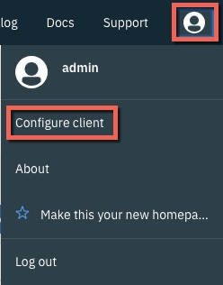

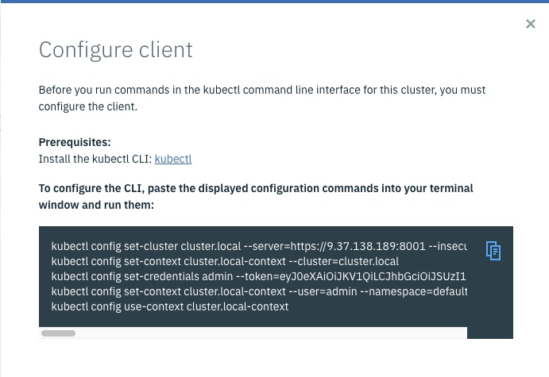

Locate the following information:

1. What should you do with the commands that are displayed here?

Close the **Configure client** dialog box

#### End of Lab Review
  In this lab exercise you became familiar with the IBM Cloud Private Administration Console by completing a Treasure Hunt. You learned about:
  - The ICP Admin Console dashboard.
  - Nodes and Namespaces, Deployments, StatefulSets, DaemonSets, Services and Ingress
  - Helm Charts.
  - Storage, Monitoring and Alerts

## End of Lab Exercise
