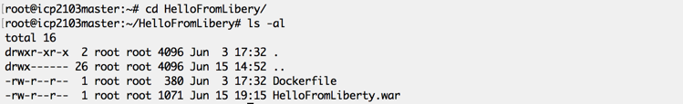

Lab - Push Docker Images to the ICP Private Docker Registry
---

### Table of contents
[1. Overview](#login)

[2. Preparing to Build a Docker Image](#prepthebuild)

[3. Build a Docker Image](#buildanimage)

[4. Prepare to Push the Docker Image to the ICP Private Docker Registry](#prepthepush)

## Overview 
In this lab exercise you will take a Java application packaged as a WAR file, build a Docker container combining the official IBM WebSphere Liberty Docker image with the application WAR file and finally we will logon to the ICP Private Docker Registry and push out custom Docker image to the registry.

### Preparing to Build a Docker Image 
You will start with an application WAR file (HelloFromLiberty.war) that has already been created for you.  This is a very simple application which contains only a single JSP that, when run, will print the message "Hello World from Liberty on IBM Cloud Private" on your browser.

Make a directory called "HelloFromLiberty" that will hold all of the components that you will be using to build your Docker image.  For this lab your new directory will contain only 2 items:

1. The "HelloFromLiberty.war" WAR file;
2. A Dockerfile.

A Dockerfile is a file that contains instruction for the Docker "build" command that describe the components and the process for building a Docker image.

Copy the HelloFromLiberty.war file into the new HelloFromLiberty directory that you just created.  Then, with the Linux editor of your choice, create a file with the name "Dockerfile" that contains the following 2 lines:

When you are finished your directory should look like this:

Next you will build the Docker image.

### Building a Docker Image 

Make sure that you are positioned in the HelloFromLiberty directory then run the Docker "build" command as shown in the following image to build your Docker image

The "-t" option in the above build command instructs Docker to add a "tag" to the image that it builds.  The "." indicates that the Dockerfile that should be used to build the Docker image is located in the current directory.  Once the Docker image has successfully been created you will not see the resulting image in the current directory, Docker build will store the newly created Docker image in the "local" Docker repository.  The "local" Docker repository is a repository that resides on the server on which you execute the Docker build command.

Once the build is complete you can use the Docker "images" command to view the contents of the local Docker repository.

### Prepare to Push the Docker Image to the ICP Private Docker Registry 

#### End of Lab Review
  In this lab exercise, you explored the IBM Cloud Private Administration Console by completing a Treasure Hunt. You learned about:
  - The ICP Admin Console dashboard
  - Nodes, Namespaces, Deployments, StatefulSets, DaemonSets, Services, and Ingress
  - Helm Charts
  - Storage, Monitoring and Alerts

## End of Lab Exercise
