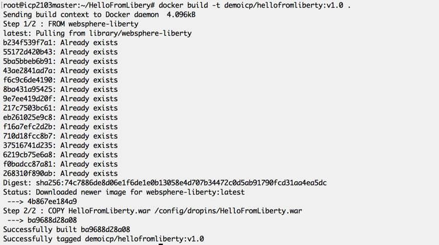
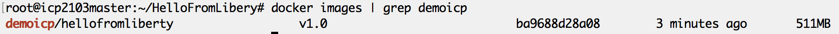
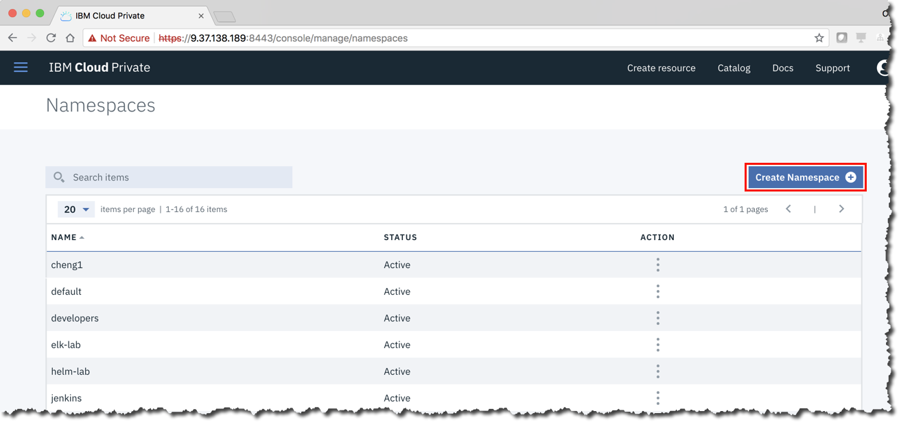
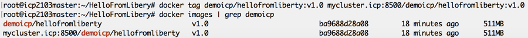
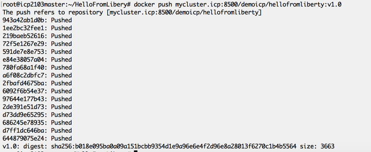

Lab - Push Docker Images to the ICP Private Docker Registry
---

### Table of contents
[1. Overview](#login)

[2. Preparing to Build a Docker Image](#prepthebuild)

[3. Build a Docker Image](#buildanimage)

[4. Prepare to Push the Docker Image to the ICP Private Docker Registry](#prepthepush)

## Overview 
In this lab exercise you will take a Java application packaged as a WAR file, build a Docker container combining the official IBM WebSphere Liberty Docker image with the application WAR file and finally we will logon to the ICP Private Docker Registry and push out custom Docker image to the registry.

## Preparing to Build a Docker Image 
You will start with an application WAR file (HelloFromLiberty.war) that has already been created for you.  This is a very simple application which contains only a single JSP that, when run, will print the message "Hello World from Liberty on IBM Cloud Private" on your browser.

Make a directory called "HelloFromLiberty" that will hold all of the components that you will be using to build your Docker image.  For this lab your new directory will contain only 2 items:

1. The "HelloFromLiberty.war" WAR file;
2. A Dockerfile.

A Dockerfile is a file that contains instruction for the Docker "build" command that describe the components and the process for building a Docker image.

Copy the HelloFromLiberty.war file into the new HelloFromLiberty directory that you just created.  Then, with the Linux editor of your choice, create a file with the name "Dockerfile" that contains the following 2 lines:

When you are finished your directory should look like this:

Next you will build the Docker image.

## Building a Docker Image 

Make sure that you are positioned in the HelloFromLiberty directory then run the Docker "build" command as shown in the following image to build your Docker image

The "-t" option in the above build command instructs Docker to add a "tag" to the image that it builds.  The "." indicates that the Dockerfile that should be used to build the Docker image is located in the current directory.  Once the Docker image has successfully been created you will not see the resulting image in the current directory, Docker build will store the newly created Docker image in the "local" Docker repository.  The "local" Docker repository is a repository that resides on the server on which you execute the Docker build command.

Once the build is complete you can use the Docker "images" command to view the contents of the local Docker repository.

## Prepare to Push the Docker Image to the ICP Private Docker Registry 

Before you can successfully push a Docker image to the ICP Private Docker Registry there are two things that you have to do to prepare:

1. ICP has to have a namespace that matches the name of the repository within the registry that you are storing the Docker image in;
2. The Docker image has to be prefixed with the URI for the ICP Private Docker Registry.

### Create a Namespace in ICP

Recall from above that when you built the Docker image the tag that was assigned contained the repository name "demoicp".  You need to make sure that ICP has a matching namespace defined.  If there is no namespace in ICP that corresponds to the repository in the ICP Private Docker Registry then you will get an authenication error when you attempt to push your Docker image.

Logon to the ICP console as admin/admin and from the navigation menu select "Namespaces"

Scroll through the list of namespaces defined in ICP and confirm that there is no namespace with the name "demoicp".  If there is an existing namespace by that name then you are done with this step there is nothing further to do other than logoff.  If, however, there is no existing namespace with the name "demoicp" create one by clicking on the "Create Namespace" button:

In the pop-up window that appears, enter the name of the new namespace "demoicp" and click the "create" button:

Once the new namespace has been created in ICP confirm that it appears in the list of available namespaces:

### Add the Registry URI to the Docker Image Tag

In order to successfully push a Docker image to the ICP Private Docker Registry the image tag must conform to the correct format as follows:

	<Registry URI>/<Repository Name>/<Image Name>:<Image Version>
	
The tag that you attached to the Docker image when you created it did not contain the registry URI as a prefix.  Before you can push the Docker image to the registry you need to add another tag to the image that conforms to the correct format.  A Docker image can be tag with an arbitrary number of tags so in this case you are adding a second tag, not renaming the existing one.  Use the Docker "tag" command to add another tag to the Docker image:

## Push a Docker Image to the ICP Private Docker Registry

You have created a Docker image, prepared the image for the ICP Private Docker Registry, and prepared ICP to receive the image.  The final 2 steps in the process are:

1. Authenticate with the ICP Private Docker Registry;
2. Push your Docker image to the registry.

### Authenticate to the ICP Private Docker Registry

To authenticate to the ICP Private Docker Registry you use the Docker "login" command with your ICP console credentials (admin/admin for this lab):

### Push a Docker Image

Now that everything is ready and you have authenticated to the ICP Private Docker Registry you can now push your Docker image to the registry:

To confirm that the new Docker image has been successfully pushed to the ICP Private Docker Registry, logon to the ICP console and confirm that the new image appears in the list of available Docker images.  Logon to the ICP Console and from the menu select "Manage --> Images"

Your Docker image should appear in the list of available Docker images

Congratulations you have successfully created a Docker image and installed it in the ICP Private Docker Registry.

## End of Lab Review
  In this lab exercise, you learned to:
  1. Prepare the directories and files required to build a Docker image;
  2. Build a Docker image with the Docker "build" command;
  2. Prepare ICP to accept a Docker image in the Private Docker Registry;
  3. Authenticate with the ICP Private Docker Registry and push a new Docker image into the registry.

## End of Lab Exercise