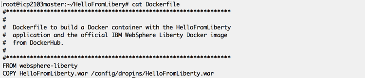
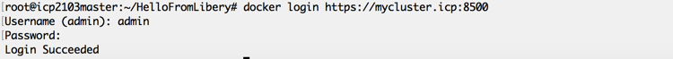

Lab - Push Docker Images to the ICP Private Docker Registry
---

### Table of contents
[1. Overview](#login)

[2. Preparing to Build a Docker Image](#prepthebuild)

[3. Build a Docker Image](#buildanimage)

[4. Prepare to Push the Docker Image to the ICP Private Docker Registry](#prepthepush)

[5. Push a Docker Image to the ICP Private Docker Registry](#pushtheimage)

## Overview <a name="Overview"></a>
In this lab exercise, you use a Java application that is packaged as a WAR file, and build a Docker container that combines the official IBM WebSphere Liberty Docker image with the application WAR file. Then, you log in to the ICP Private Docker Registry, and push the custom Docker image to the registry.

## Preparing to Build a Docker Image <a name="prepthebuild"></a>
You start with an application WAR file (HelloFromLiberty.war) that is already created. This application is very simple, and  contains a single JSP that, when run, prints the message "Hello World from Liberty on IBM Cloud Private" in your browser.


Make a directory called "HelloFromLiberty" to hold all of the components that you use to build your Docker image.  For this lab, your new directory will contain only two items:

1. The "HelloFromLiberty.war" WAR file.
2. A Dockerfile.

A Dockerfile is a file that contains instructions for the Docker "build" command that describes the components and the process for building a Docker image.

Copy the [HelloFromLiberty.war](Assets/privateregistry/HelloFromLiberty.war) file into the HelloFromLiberty directory that you just created. Using the editor of your choice, create a file with the name "Dockerfile" that contains the following two lines:



When you are finished, your directory should look like this:


Next, you build the Docker image.

## Build a Docker Image <a name="buildanimage"></a>

Make sure that you are in the HelloFromLiberty directory, and then run the Docker "build" command as shown in the following image.

**Replace demoicp with the name of your namespace you created earlier this week**


The "-t" option in the above build command instructs Docker to add a "tag" to the image that it builds.  The "." indicates that the Dockerfile to use to build the Docker image is located in the current directory.  After the Docker image is successfully created, you do not see the resulting image in the current directory. Docker build stores the newly created Docker image in the "local" Docker repository.  The "local" Docker repository is a repository that resides on the server on which you execute the Docker build command.

After the build is complete, you can use the Docker "images" command to view the contents of the local Docker repository.

**Replace demoicp with the name of your namespace you created earlier this week**


## Prepare to Push the Docker Image to the ICP Private Docker Registry <a name="prepthepush"></a>

Before you can successfully push a Docker image to the ICP Private Docker Registry, there are two things that you must do to prepare:

1. ICP must have a namespace that matches the name of the repository within the registry that you are storing the Docker image in.
2. The Docker image must be prefixed with the URI for the ICP Private Docker Registry.

### Add the Registry URI to the Docker Image Tag

To successfully push a Docker image to the ICP Private Docker Registry, the image tag must conform to the correct format, as follows:

	<Registry URI>/<Repository Name>/<Image Name>:<Image Version>
	
The tag that you attached to the Docker image when you created it does not contain the registry URI as a prefix.  Before you can push the Docker image to the registry, you must add another tag to the image. A Docker image can be tagged with an any number of tags, so in this case, so you can add a tag, rather than rename one.  Use the Docker "tag" command to add a tag to the Docker image:


## Push a Docker Image to the ICP Private Docker Registry <a name="pushtheimage"></a>

You created a Docker image, prepared the image for the ICP Private Docker Registry, and prepared ICP to receive the image.  The final two steps in the process are:

1. Add the ICP master IP address to your hosts file
2. Authenticate with the ICP Private Docker Registry.
3. Push your Docker image to the registry.

### Add the ICP master IP address to the hosts file

On your laptop, add the following line to `/etc/hosts` file:

```
<master-node-IP-address> mycluster.icp
```

You can test it's working by running the following command:

```
ping mycluster.icp
```

### Configure authentication to the Docker CLI

Before we login to docker, we need to import the SSL certificate to your local machine. 

Follow the instrutions provided at https://www.ibm.com/support/knowledgecenter/SSBS6K_2.1.0.3/manage_images/configuring_docker_cli.html to create the directory in your laptop with one change:

* Instead of running scp to copy the certificate from the Master Node, run the following command:

```
openssl s_client -connect mycluster.icp:8500 -showcerts 2>/dev/null | openssl x509 -outform PEM > ~/.docker/certs.d/mycluster.icp:8500/ca.crt
```

### Authenticate to the ICP Private Docker Registry

To authenticate to the ICP Private Docker Registry, use the Docker "login" command with your ICP console credentials (admin/admin):



### Push a Docker Image

Now that everything is ready, and you authenticated to the ICP Private Docker Registry, you can push your Docker image to the registry:


To confirm that the new Docker image is successfully pushed to the ICP Private Docker Registry, log in to the ICP console, and confirm that the new image appears in the list of available Docker images. From the menu, select "Manage --> Images"


Your Docker image should appear in the list of available Docker images.


Congratulations! You successfully created a Docker image, and installed it in the ICP Private Docker Registry.

## End of Lab Review
  In this lab exercise, you learned how to:
  1. Prepare the directories and files required to build a Docker image.
  2. Build a Docker image with the Docker "build" command.
  2. Prepare ICP to accept a Docker image in the Private Docker Registry.
  3. Authenticate with the ICP Private Docker Registry and push a new Docker image into the registry.

## End of Lab Exercise
